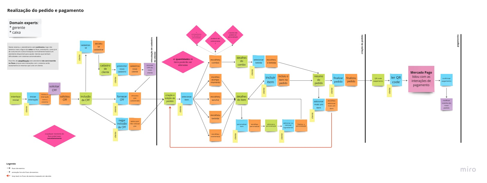
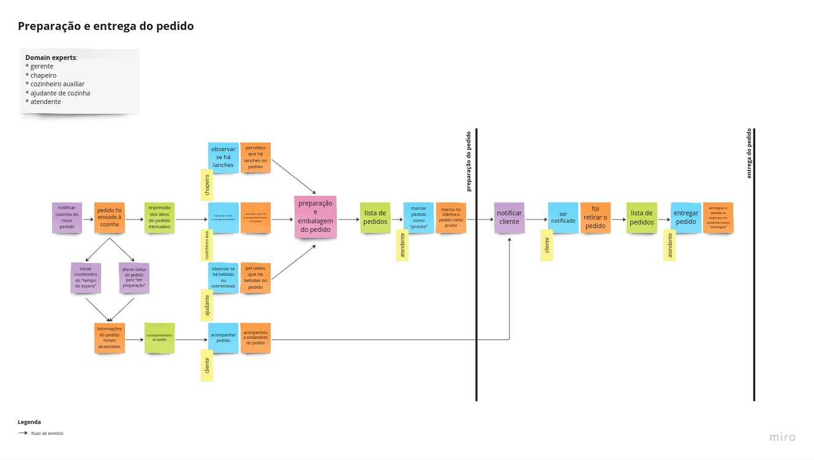
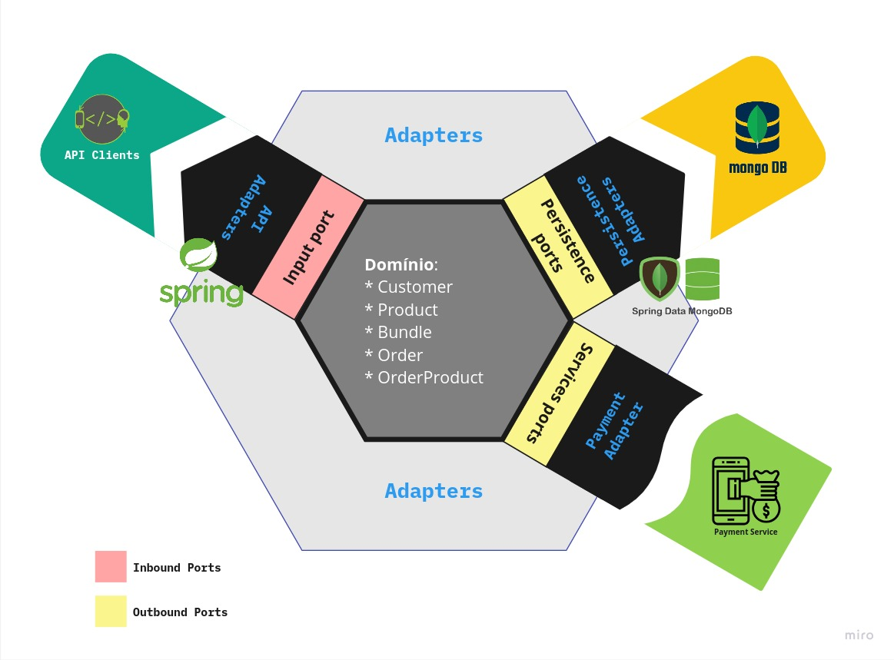

# Tech Challenge
Trabalho desenvolvido pela aluna **Gabriela Carvalho Camilo** como forma de avaliação da **1ª Fase** no curso de pós-graduação em **software architecture** na FIAP.

## Roadmap

[x] - **1ª Fase**
# FASE 1 - Aplicação proposta

**STATUS**: **Finalizada**

Implementar uma aplicação de backend para automatizar o processo de pedidos de uma lanchonete. Para isto deve-se usar a arquitetura hexagonal e a implementação deve ser feita em um monolito.

A proposta completa do trabalho pode ser encontrada [aqui](PROPOSTA.md).

- [Tech Challenge](#tech-challenge)
- [Aplicação proposta](#aplicação-proposta)
- [Executando o Projeto](#executando-o-projeto)
- [Requisitos](#requisitos)
- [Padrões de Projeto](#padrões-de-projeto)
  - [Nomenclatura](#nomenclatura)
  - [Event Storming](#event-storming)
  - [Arquitetura](#arquitetura)
    - [Domain](#domain)
      - [**Customer**](#customer)
      - [**Product**](#product)
      - [**Bundle**](#bundle)
      - [**OrderProduct**](#orderproduct)
      - [**Order**](#order)
    - [Portas/ Adaptadores](#portas-adaptadores)
      - [**Service Ports/ Adapters**](#service-ports-adapters)
      - [**Persistence Ports/ Adapters**](#persistence-ports-adapters)
    - [Considerações Sobre a Arquitetura](#considerações-sobre-a-arquitetura)
  - [Dicionário de Linguagem Ubíqua](#dicionário-de-linguagem-ubíqua)
  
# Executando o Projeto Localmente

O único requisito **obrigatório** para executar este projeto é ter o [Docker](https://www.docker.com) instalado.

No diretório do projeto:
    
```bash

    $ docker-compose up
    
``` 

**URL Padrão da API: http://localhost:8080/api/v1**

É recomendada a utilização do [Insomnia](https://insomnia.rest) para testar a API. A Collection para teste encontra-se no arquivo
`insomnia-collection.json` na raiz do projeto.

# Padrões de Projeto

## Nomenclatura

O código foi implementado seguindo a norma de idioma **inglês** esta decisão foi tomada para evitar confusões causadas
por traduções livres, principalmente de estruturas pertinentes à arquitetura e domínio da aplicação, cuja literatura
encontra-se majoritariamente neste idioma. As traduções dos termos em inglês estão definidos juntamente com o [dicionário
de linguagem ubíqua](#dicionário-de-linguagem-ubíqua).

## Event Storming

A Estratégia de Event Storming foi utilizada para a modelagem do domínio da aplicação.
Foram modelados os fluxos  de [Realização do pedido e pagamento - Figura 1](#figura1) e [Preparação e entrega do pedido - Figura 2](#figura1).

O resultado completo do processo pode ser encontrado no seguinte [quadro no Miro](https://miro.com/app/board/uXjVOvZPCDs=/)




## Arquitetura
Para a implementação do projeto foi escolhido o padrão de arquitetura **Hexagonal** ilustrada na [Figura 3](#figura3).


### Domain
Como mostrado na figura, os domínios da aplicação consistirão em:

#### **Customer**

O cliente cadastrado da lanchonete.

#### **Product**

Qualquer **produto** do menu. Produtos podem ser do tipo:

| Tipo de produto | Descrição |
| --- | --- |
| DRINK | Qualquer bebida oferecida na lanchonete |
| SIDE | Qualquer acompanhamento oferecido na lanchonete |
| DESERT | Qualquer sobremesa oferecida na lanchonete |
| SANDWICH | Qualquer lanche oferecido na lanchonete |
| BUNDLE | Qualquer combo oferecido na lanchonete |
| ADDON | Qualquer adicional de qualquer produto |
  
#### **Bundle**

É um **combo** de produtos cuja venda casada pode gerar um desconto ao consumidor.
Consiste basicamente em um produto que contém uma lista de produtos e um campo "discountPercentage" que armazena a porcentagem de desconto oferecida a quem comprar o combo.

#### **OrderProduct**

É um objeto que representa um **produto dentro de um pedido**, ou seja, além do produto possui atributos de quantidade (quantity) e adicionais (addOns) para representar respectivamente quantos produtos do tipo foram incluídos e uma lista com os adicionais selecionados, se houver.

#### **Order**

É um **pedido** feito por um cliente cadastrado ou não.
Consiste em uma lista de produtos do tipo OrderProduct, além de um cliente (Customer) e dados referentes ao status do pedido (status) e status do pagamento (payment status).

Os possíveis status são:

| Status | Descrição |
| --- | --- |
| PENDING | **Pendente**: um pedido que acabou de ser realizado e ainda está sendo processado |
| COOKING | **Em preparação**: o pagamento já foi aprovado e já está sendo preparado pela cozinha |
| READY | **Pronto**: A cozinha já finalizou o preparo do pedido|
| DELIVERED | **Entregue**: o cliente já retirou o pedido |
| CANCELED | **Pedido cancelado** |

Os possíveis status de pagamento são:

| Status | Descrição |
| --- | --- |
| PENDING | **PendPendente**: um pedido que acabou de ser realizado e ainda não teve o pagamento processado |
| APPROVED | **Aprovado**: o serviço de pagamento aprovou o pagamento |
| REJECTED | **Rejeitado**: o serviço de pagamento rejeitou o pagamento, caso isto ocorra o pedido deverá ser cancelado|

### Portas/ Adaptadores

As Portas implementadas foram basicamente para lidar com **persistência** e **serviços**.
Sendo um implementação em Java, foi aproveitada a estrutura de **interfaces** para criar as portas e a implementação dessas interfaces para criar os adaptadores.

#### **Service Ports/ Adapters**

Têm como objetivo expor o domínio a possíveis serviços de inbound e outbound.
Os serviços implementados foram referentes à uma **API REST** implementada utilizando a estrutura do framework Spring Boot e Spring Web MVC, além de um **serviço de pagamentos** que será implementado nas próximas iterações deste trabalho, e que por enquanto apenas aprova automaticamente o pagamento de todos os pedidos.

#### **Persistence Ports/ Adapters**

A interface de persistência de dados acessa uma implementação que utiliza um repository Spring Data MongoDB a qual persiste os dados da aplicação.

### Considerações Sobre a Arquitetura

A **Arquitetura Hexagonal**, ou **Ports and Adapters Architecture** provê um alto desacoplamento entre as regras do "core" da aplicação e as tecnologias utilizadas para implementar os diferentes serviços. Nesta aplicação isto fica claro quando observa-se que cada serviço utiliza uma tecnologia própria, e que se um dia estas tecnologias necessitarem ser trocadas isto não deve impactar o core business da aplicação que está isolado e permanecerá funcionando da mesma forma.

Em contrapartida percebe-se um aumento significativo de verbosidade no projeto devido à grande quantidade de conversões e mapeamentos entre as classes, aumentando a complexidade e diminuindo a legibilidade do código. Isto se deve principalmente ao fato de a aplicação estar escrita na forma de "monolito", fazendo com que esta tenha muitas responsabilidades centralizadas. Caso a aplicação fosse dividida em microsserviços a arquitetura hexagonal faria mais sentido, pois em serviços atômicos o aumento da complexidade torna-se menos relevante ressaltando a vantagem principal desta arquitetura que é o isolamento das regras de negócio.


## Dicionário de Linguagem Ubíqua
| Termo (pt-br) como acordado com os domain experts | Termo em inglês (quando presente no sistema) | Definição |
| --- | --- | --- |
| bebida | DRINK | qualquer bebida no cardápio, ex. suco, refrigerante, bebida alcoólica, etc |
| acompanhamento | SIDE | porções que normalmente acompanham os lanches, (ex. batata frita, onion rings) |
| adicionais | ADDON | ingredientes adicionados a itens (ex. dobro de queijo, adicionar mostarda, adicionar calda de chocolate, limão e gelo no refrigerante, etc.) |
| sobremesa | DESERT | qualquer doce do cardápio |
| combo | BUNDLE | uma oferta casada de itens geralmente atrelada a um desconto |
| lanche | SANDWICH | sanduíche presente no cardápio (ex. hambúrguer, queijo quente, X-Tudo) |
| personalização | - | remoção ou adição de ingredientes do lanche via adicionais (ADDON) ou observação (note) |
| itens | items | geralmente refere-se aos itens presentes em um combo ou pedido, resumidamente são produtos do cardápio quando agrupados em um contexto específico. |
| pedido | Order | um ou mais itens selecionados pelo cliente |
| chapeiro | - | pessoa cozinheira responsável pela preparação e montagem de lanches |
| cozinheiro auxiliar | - | pessoa responsável pela preparação e montagem de porções |
| ajudante de cozinha | - | pessoa responsável por embalar e separar pedidos, além de servir bebidas e sobremesas |
| gerente | - | pessoa responsável por coordenar as operações da lanchonete |
| atendente | - | pessoa responsável por atualizar os status de pedido no sistema e interagir com o cliente além de manusear produtos “prontos” como bebidas e sobremesas. |
| cliente | Customer | qualquer pessoa que utilizará o sistema |
| status do pedido | OrderStatus: COOKING, READY, DELIVERED, PENDING, CANCELED. | Status do pedido que poderá ser: “Em preparação”, “Pronto”, “Entregue”, “Pendente”, “Cancelado” |
| status do pagamento | PaymentStatus: PENDING, APPROVED, REJECTED | Status do pagamento que poderá ser: “Pendente”, “Aprovado”, “Rejeitado” |
| produto | Product | qualquer item do cardápio, podendo ser lanche, bebida, acompanhamento, sobremesa, combo ou adicional |